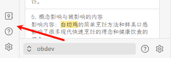
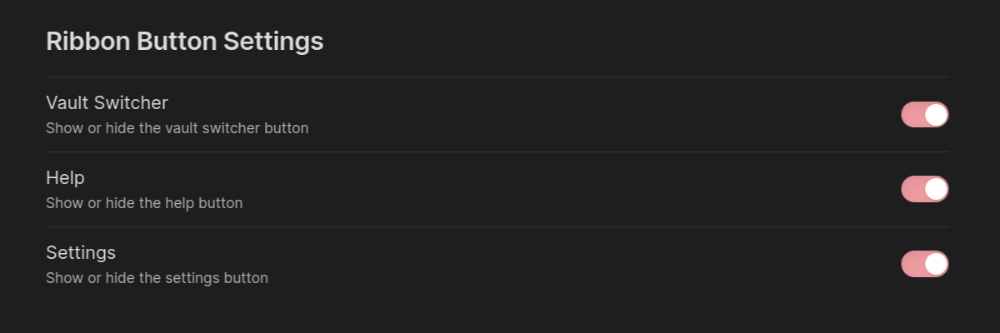

# Legacy vault switcher

An [Obsidian](https://obsidian.md/) plugin that brings back the pre-1.6.0 vault switcher, help, and settings buttons.

# Installation

### BRAT

[BRAT](https://github.com/TfTHacker/obsidian42-brat) (Beta Reviewer's Auto-update Tool) is a plugin that allows users to
install Obsidian plugins directly from GitHub with automatic updates.

via Commands:

1. Ensure BRAT is installed
2. Enter the command `BRAT: Plugins: Add a beta plugin for testing`
3. Enter `Quorafind/Obsidian-Legacy-Vault-Switcher`
4. Click on Add Plugin

via Settings:

1. Ensure BRAT is installed
2. Go to *Settings > BRAT > Beta Plugin List*
3. Click on Add Beta plugin
4. Enter `Quorafind/Obsidian-Legacy-Vault-Switcher`
5. Click on Add Plugin

### Manual

Option 1:

1. Go to [Releases](https://github.com/Quorafind/Obsidian-Legacy-Vault-Switcher/releases)
2. Download the latest `Obsidian-Legacy-Vault-Switcher-${version}.rar`
3. Extract its contents
4. Move the contents into /your-vault/.obsidian/plugins/obsidian-legacy-vault-switcher/
5. Go to *Settings > Community plugins*
6. Enable Legacy vault switcher

Option 2:

1. Go to [Releases](https://github.com/Quorafind/Obsidian-Legacy-Vault-Switcher/releases)
2. Download the latest `main.js` and `manifest.json`
3. Move the files into /your-vault/.obsidian/plugins/obsidian-legacy-vault-switcher/
5. Go to *Settings > Community plugins*
6. Enable Legacy vault switcher
